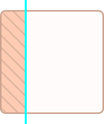

# Options
Sentinel DOM library has a list of declarative options which grant precise control over the tracking logic.

* [Root options](#root-options)
  * [Targets](#targets)
  * [Custom boundaries](#bounds)
  * [Throttling](#throttle)
  * [Unique impressions](#once)
  * [Debug mode](#debug)
  * [Snapshots](#snapshots)

* [Snapshot options](#snapshot-options)
  * [Named snapshots](#named-snapshots)
  * [Unique snapshots](#unique-snapshots)
  * [Offsets](#offsets)
  * [Bleeding edges](#bleeding-edges)
  * [Thresholds (delta areas)](#thresholds)
  * [Callback function](#callback)

## Root options
### Targets
* `targets: Array<HTMLElement> | HTMLElement`

One or mutliple DOM elements to be tracked.

```js
new Tracker({
  targets: document.getElementsByClassName('box'),
  // ...
});
```

### Bounds
* `bounds?: HTMLElement` (default: `window`)

Boundaries against which the tracking is performed. You may want to provide custom boundaries to make the tracking more performant.

```js
new Tracker({
  // ...
  bounds: document.getElementById('custom-bounds'),
  // ...
})
```

### Throttle
* `throttle?: number` (default: `250`)

Throttle amount (**ms**) between each tracking attempt.

```js
new Tracker({
  // ...
  throttle: 1000, // attempt tracking no more than once per second
  // ...
});
```

### Once
* `once?: boolean` (default: `false`)

Should each snapshot invoke its callback only once, after the first successful tracking. Setting this to `false` will trigger snapshot's callback function each time the target becomes visible within the bounds.

```js
new Tracker({
  // ...
  once: true, // forbid snapshot callbacks to be called more than once
  // ...
});
```
Setting `once` on a root options level applies it to all the snapshots, unless the latter has its own `once` options specified:

```js
new Tracker({
  once: true, // root level option
  snapshots: [
    {
      once: false, // snapshot level option
      callback() { ... } // this callback is called multiple times
    },
    {
      callback() { ... } // this callback is called once
    }
  ]
})
```

### Debug
* `debug?: boolean` (default: `false`)

Enable/disable debug mode.

```js
new Tracker({
  debug: true,
  // ...
});
```

Debug mode is meant for monitoring the steps of tracking attempts in the console. It is useful during the investigation of the tracking behavior.

> **Note:** Debug mode may decrease the tracking performance due to adding extra operations (logging) after each tracking step. Consider **not to turn it on** unless needed.

### Snapshots
* `snapshots: Array<Snapshot>`

A list of the snapshots to take per each tracking attempt.

```js
new Tracker({
  // ...
  snapshots: [
    {
      edgeY: 10, // when scroll position is at 10% of target's height or more
      callback() { ... }
    },
    {
      thresholdY: 50, // when exactly 50% of the target's height becomes visible
      callback() { ... }
    }
  ]
});
```

The benefit of a snapshot system is that you are able to perform multiple tracking operations against the same target/bounds within a single declaration.

## Snapshot options
Most of the tracking logic is defined through the snapshot options.

Provided snapshot options have higher priority and overwrite the root options (i.e. `once`). Consider this for a granular control over each individual snapshot. **Remember** that you can combine snapshot options to achieve the logic you need.

### Named snapshots
* `name?: string`

The name of a snapshot. Useful primarily for debugging purposes. When performing multiple snapshots they will appear named in the debug mode, if they have `name` option specified.
```js
new Tracker({
  // ...
  snapshots: [
    {
      name: 'Box has appeared',
      callback() { ... }
    }
  ]
})
```

### Unique snapshots
* `once?: boolean` (default: `false`)

Similar to the [root option](#once), `once` allows/forbids to perform the callback function multiple times, after the target has appear the first time. Setting this option on a certain snapshot will overwrite the `once` option provided in the root options.
```js
new Tracker({
  snapshots: [
    {
      callback() { ... } // this callback fires multiple times
    },
    {
      once: true, // this callback fires only once
      callback() { ... }
    }
  ]
})
```

### Offsets
* `offsetX?: number` (default: `0`)
* `offsetY?: number` (default: `0`)

*Offset* - is an absolute amount of pixels (**px**) to add to the current bleeding edge/threshold. Supports negative values as well.

For example, a callback function should be called once there is still 10 pixels left to the actual top edge of the target:
```js
new Tracker({
  // ...
  snapshots: [
    {
      edgeY: 0, // expect the very top coordinate of the target to appear
      offsetY: -10, // negative value because the top position should be less than actual
      callback() { ... }
    }
  ]
});
```

<div align="center">
  
  <p>Setting vertical offset to -10px.</p>
</div>

One the blue line appear in the viewport, a snapshot will be considered successful. Similarly, offsets affect [Bleeding edges](#bleeding-edges) or [Thresholds](#thresholds) if the latter are specified. The same logic applies to the horizontal offset (`offsetX`).

> **Note:** If your tracking logic relies on the percentage of the target's width/height see [Threshold options](#thresholds) instead. Do **not** use offset option for this purpose.

### Bleeding edges
* `edgeX?: number`
* `edgeY?: number`

*Bleeding edge* - is an imaginary line drawn at a relative coordinate on one of the target's axis.

It is possible to set expected horizontal (`edgeX`) and vertical (`edgeY`) bleeding edges. Bleeding edges are set in percentages (**%**) relatively to the target's width or height respectively.

```js
new Tracker({
  // ...
  snapshots: [
    {
      edgeX: 25,
      callback() { ... }
    }
  ]
});
```

<div align="center">
  
  <p>Setting horizontal bleeding edge to 25%.</p>
</div>

Setting `edgeX: 25` will draw a line at 25 percent of the target's width. The blue line (bleeding edge) on a picture should appear in the viewport <b>and</b> bounds (in case of custom bounds) in order to fire a callback function.

> Note: Bleeding edges are unaware of scroll direction. That means that the **exact** coordinate should be met. Using the current example (`edgeX: 25`), if you were scrolling from right to left, you would need to scroll to **75%** of the target's width to meet the bleeding edge.

```js
new Tracker({
  // ...
  snapshots: [
    {
      edgeY: 25,
      callback() { ... }
    }
  ]
});
```

<div align="center">
  
  <p>Setting vertical bleeding edge to 25%.</p>
</div>

<p>In this example we set <code>edgeY: 25</code>. The blue line represents a vertical bleeding edge which should be in viewport <b>and</b> bounds (in case of custom bounds) in order to trigger a callback.</p>

Generally, using `edgeX` and `edgeY` is recommended when your visibility logic relies on *uniderictional* scroll behavior. For example, when you need to determine if user is reading something. It is obvious that reading happens from top to bottom, so setting `edgeY` at low percentage would ensure user has started reading, while at high percentage - that he has read an article competely.

> **Note:** You should **not** combine any of the edge options with threshold options. They are mutually exclusive.

### Thresholds
* `thresholdX?: number` (default: `100`)
* `thresholdY?: number` (default: `100`)

*Threshold* - is a percentage of the target's width/height which should appear in the viewport and bounds in order for a snapshot to be successful. By default, thresholds for both axis are set to `100` percent, which means that the target is considered visible *only* when all its height and width is present in the viewport/bounds. You can change this behavior by specifying custom percentages to the respective options.

Lets say you would like to execute a certain callback only when at least **75%** of the element's height is in the viewport. You can achieve this by setting `thresholdY: 75` as a snapshot option.

```js
const Tracker({
  // ...
  snapshots: [
    {
      thresholdY: 75,
      callback() { ... }
    }
  ]
});
```

This would render a *delta area* demonstrated as striped rectangles below:

<div align="center">
  
  <p>Setting vertical threshold to 75%.</p>
</div>

As you can see, delta areas are *omnidirectional*, meaning that they are expected to appear regardless of the scroll direction. This is the main difference between thresholds and [Bleeding edges](#bleeding-edges). The same rules apply to the horizontal threshold.

One of the powerful features of the thresholds is the ability to combine them:
```js
new Tracker({
  // ...
  snapshots: [
    {
      thresholdX: 75,
      thresholdY: 75,
      callback() { ... }
    }
  ]
});
```

<div align="center">
  
  <p>Setting vertical and horizontal thresholds to 75%.</p>
</div>

When any of these delta areas appear in the viewport/bounds, the snapshot becomes successsful, and a callback function is called.

> **Note:** Treshold options **do not** accept negative values. If you would like to trigger the callback function at the negative space before the actual target's dimensions please see [Bleeding edges](#bleeding-edges).

### Callback
* `callback: Function(args: TCallbackArgs): any`

Callback function which is called immediately when snapshot becomes successful (the target is visible within the bounds).

Callback function has the following arguments:
```js
type TCallbackArgs = {
  DOMElement: HTMLElement // a reference to the visible element in the DOM
}
```

Let's say we would like to add a certian class name to the element once it becomes visible:
```js
new Tracker({
  target: document.getElementsByClassName('box'),
  once: true,
  snapshots: [
    {
      callback({ DOMElement }) {
        DOMElement.classList.add('tracked');
      }
    }
  ]
});
```
